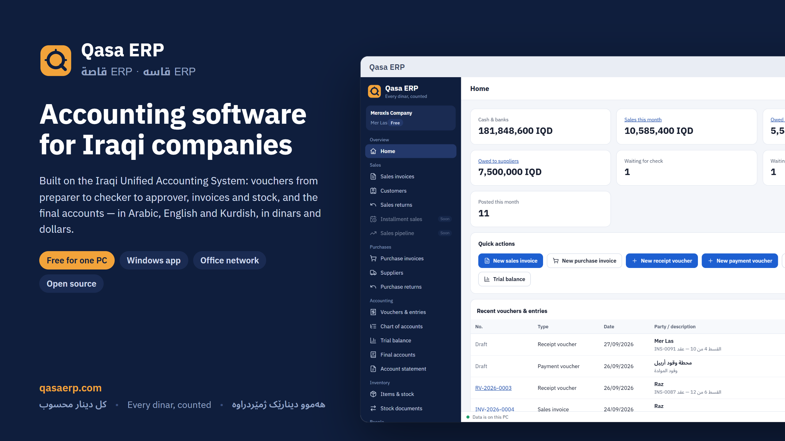
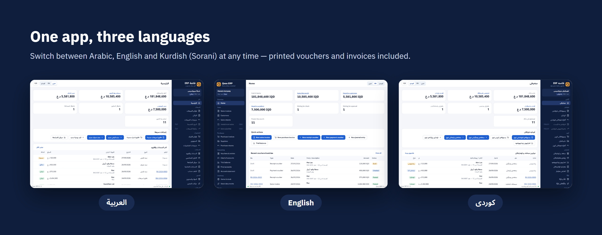
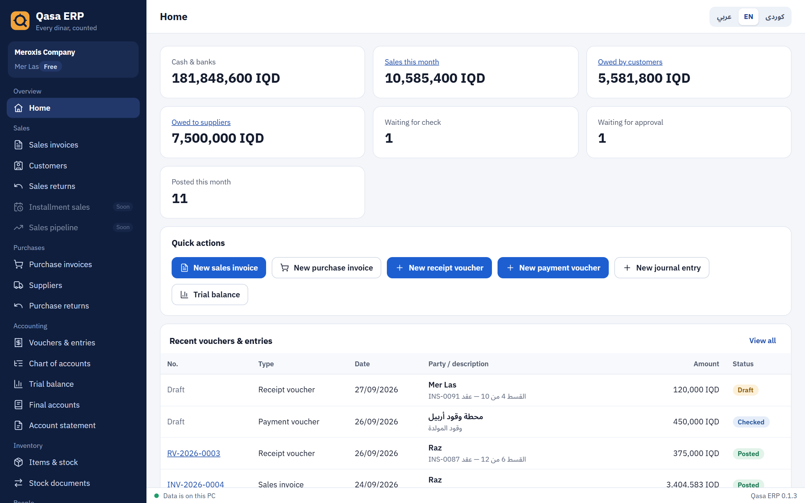
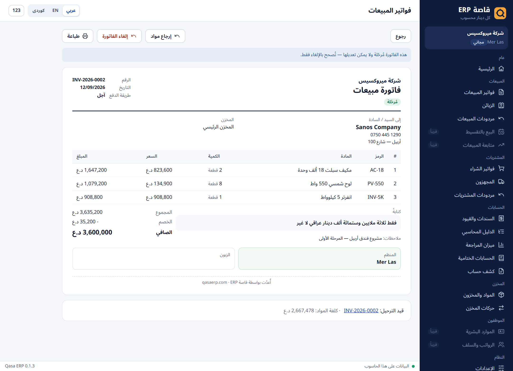
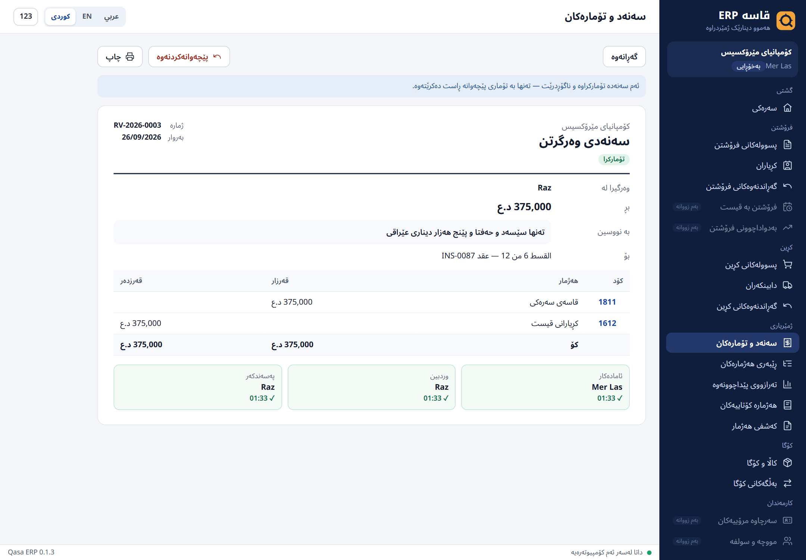
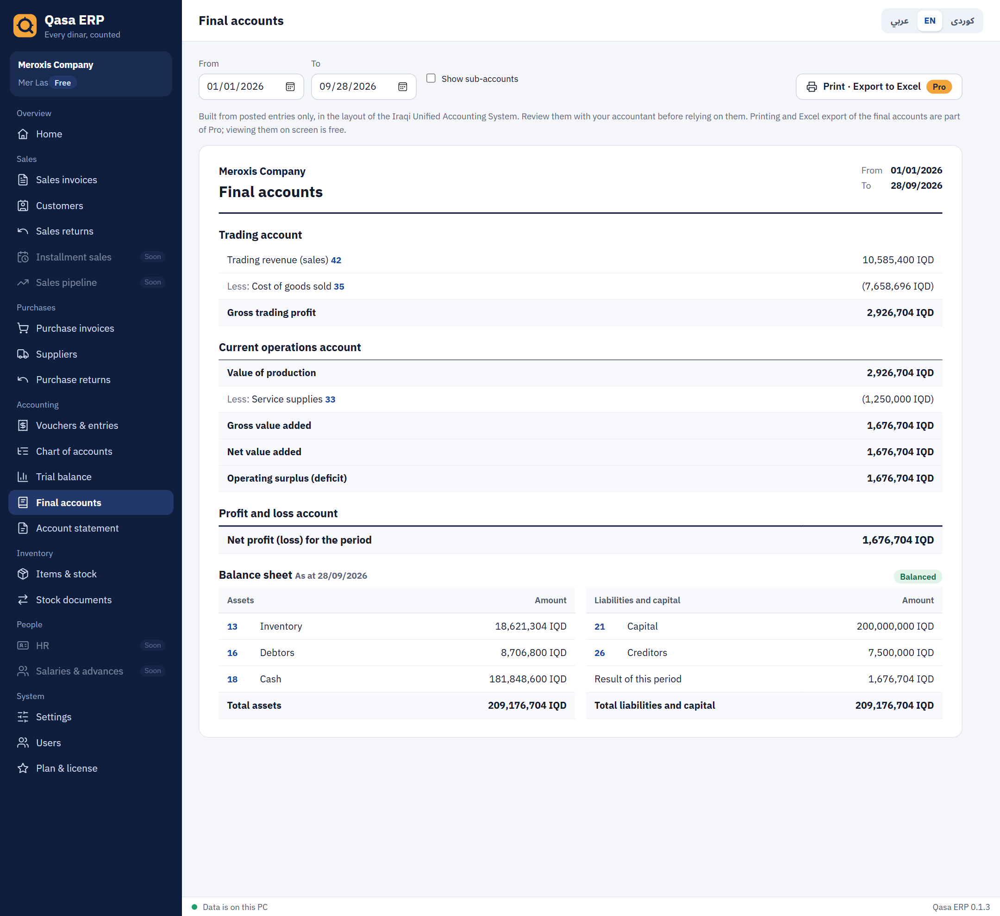
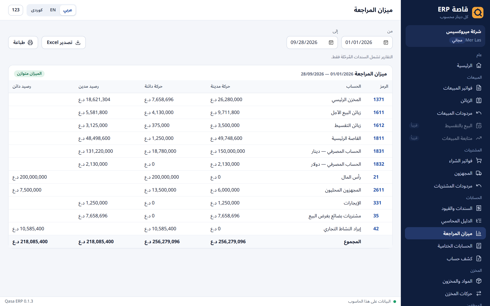
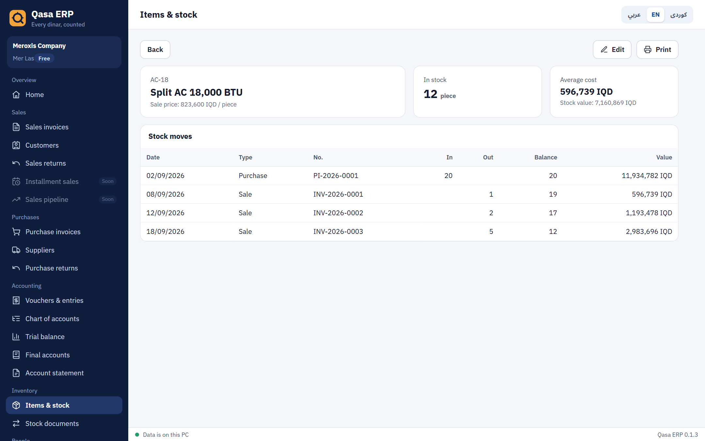
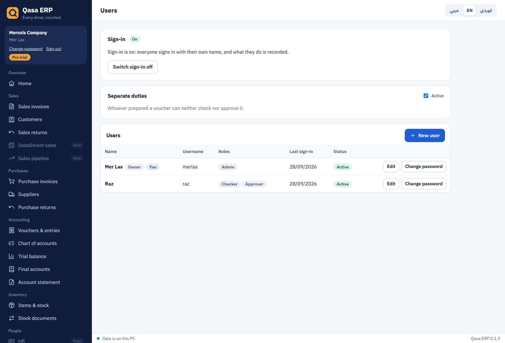

<p align="center">
  
</p>

<h1 align="center">Qasa ERP · قاصة ERP · قاسە ERP</h1>

<p align="center">
  <strong>Accounting software for Iraqi companies, built on the Iraqi Unified Accounting System.<br>Arabic, English and Kurdish. Dinars and dollars. Free for one PC.</strong>
</p>

<p align="center">
  <a href="https://github.com/meroxis/qasa-erp/releases/latest/download/Qasa-ERP-Setup.exe"></a>
  <a href="https://qasaerp.com/demo/"></a>
</p>

<p align="center">
  <a href="https://github.com/meroxis/qasa-erp/releases/latest"></a>
  <a href="https://github.com/meroxis/qasa-erp/actions/workflows/tests.yml"></a>
  <a href="LICENSE"></a>
  <a href="https://github.com/sponsors/meroxis"></a>
</p>

<p align="center">
  <a href="https://qasaerp.com">Website</a> ·
  <a href="#what-it-does">Features</a> ·
  <a href="#screenshots">Screenshots</a> ·
  <a href="#plans">Plans</a> ·
  <a href="https://qasaerp.com/en/compare/">Compare</a> ·
  <a href="https://qasaerp.com/en/switch/">Switch from Excel</a> ·
  <a href="#run-it">Run it</a> ·
  <a href="#license">License</a>
</p>

## What it does

Qasa ERP keeps the books of an Iraqi company the way its finance department already works.

- **The books, the Iraqi way.** The unified chart of accounts (النظام المحاسبي الموحد), receipt and payment vouchers and
  journal entries that go from preparer (المنظم) to checker (المدقق) to approver (المصادق), gap-free numbers,
  corrections by reversal rather than editing, period locking and a full audit log.
- **Sales, purchases and stock.** Invoices with the total in words (تفقيط), returns, customers and suppliers with
  statements and credit limits, warehouses, opening stock and transfers, all valued at weighted average cost.
- **Reports that close the year.** Trial balance, account statements and the final accounts: the trading, current
  operations and profit and loss accounts, and the balance sheet.
- **Three languages, two currencies.** Arabic, English and Kurdish (Sorani), switchable at any time, with Arabic-Indic
  digits if you prefer; dinars and dollars at the day's rate.
- **A team, with controls.** Sign-in, roles, and separate duties, so whoever prepares a voucher cannot approve it.
- **On your own PC.** The Windows app keeps the company file on your computer, works without internet and updates
  itself. An office-network edition and an online edition share the same code.

<div dir="rtl" lang="ar">

**بالعربية:** قاصة ERP برنامج محاسبة مجاني ومفتوح المصدر للشركات العراقية، مبني على النظام المحاسبي الموحد: سندات القبض
والصرف والقيود اليومية بتسلسل المنظم والمدقق والمصادق، وفواتير المبيعات والمشتريات ومردوداتها، والمخزن بمتوسط الكلفة،
وميزان المراجعة والحسابات الختامية، بالدينار والدولار. يعمل على ويندوز دون إنترنت، وبالعربية والكوردية والإنجليزية.
[جرّب النسخة التجريبية](https://qasaerp.com/demo/) أو [نزّل البرنامج](https://github.com/meroxis/qasa-erp/releases/latest/download/Qasa-ERP-Setup.exe).

</div>

<div dir="rtl" lang="ckb">

**بە کوردی:** قاسە ERP بەرنامەیەکی ژمێریاریی بەخۆڕایی و سەرچاوەکراوەیە بۆ کۆمپانیا عێراقییەکان، لەسەر سیستەمی ژمێریاریی
یەکگرتوو: سەنەدی وەرگرتن و پارەدان و تۆماری ڕۆژانە بە زنجیرەی ئامادەکار و وردبین و پەسەندکەر، پسوولەی فرۆشتن و کڕین و
گەڕاندنەوەکانیان، کۆگا بە تێچووی مامناوەند، تەرازووی پێداچوونەوە و هەژمارە کۆتاییەکان، بە دینار و دۆلار. لەسەر ویندۆز بێ
ئینتەرنێت کار دەکات، بە کوردی و عەرەبی و ئینگلیزی.
[وەشانی تاقیکردنەوە](https://qasaerp.com/demo/) یان [داگرتنی بەرنامەکە](https://github.com/meroxis/qasa-erp/releases/latest/download/Qasa-ERP-Setup.exe).

</div>

> **Status: Release 1 in progress.** See the [progress list](#release-1-progress). The [live demo](https://qasaerp.com/demo/)
> runs entirely in your browser with a sample company: nothing is sent to a server, and a reload starts it afresh.

## Screenshots

<p align="center">
  
</p>

<table>
  <tr>
    <td width="50%" valign="top">
      
      <p><strong>Dashboard</strong><br><sub>Cash and banks, this month's sales, what customers and suppliers owe, and the vouchers waiting for check or approval.</sub></p>
    </td>
    <td width="50%" valign="top">
      
      <p><strong>Sales invoice · Arabic</strong><br><sub>Ready to print, with the discount and the total in words. Returns are made from here.</sub></p>
    </td>
  </tr>
  <tr>
    <td width="50%" valign="top">
      
      <p><strong>Receipt voucher · Kurdish</strong><br><sub>Prepared, checked and approved by different people; each signature is recorded with its time.</sub></p>
    </td>
    <td width="50%" valign="top">
      
      <p><strong>Final accounts</strong><br><sub>Trading, current operations and profit and loss accounts, and a balance sheet that checks itself.</sub></p>
    </td>
  </tr>
  <tr>
    <td width="50%" valign="top">
      
      <p><strong>Trial balance · Arabic</strong><br><sub>Movements and balances in two columns, as Iraqi accountants expect, with Excel export.</sub></p>
    </td>
    <td width="50%" valign="top">
      
      <p><strong>Stock card</strong><br><sub>Every move of an item, with the running quantity and its value at average cost.</sub></p>
    </td>
  </tr>
  <tr>
    <td width="50%" valign="top">
      
      <p><strong>Users and roles</strong><br><sub>Sign-in, roles for each person and separate duties for a team (Pro).</sub></p>
    </td>
    <td width="50%" valign="middle" align="center">
      <p><strong>Try it yourself</strong></p>
      <p><a href="https://qasaerp.com/demo/">Open the live demo</a><br><sub>No sign-up, no download</sub></p>
      <p><a href="https://github.com/meroxis/qasa-erp/releases/latest/download/Qasa-ERP-Setup.exe">Download for Windows</a><br><sub>Free for one PC</sub></p>
    </td>
  </tr>
</table>

<sub>The screenshots show the sample company that comes with the app (<code>npm run seed:demo</code>). <code>node scripts/screenshots.mjs</code> takes them again.</sub>

## Run it

Needs Node.js 24 or newer.

```bash
npm install
npm run seed:demo   # optional: sample company with customers, items, invoices and vouchers
npm run dev         # API on :4417 + app on http://localhost:5173
npm test            # core + API tests
npm run typecheck
```

The database is `data/qasa.sqlite` (set `QASA_DATA_DIR` to move it). Delete the `data` folder to start fresh.

## Windows app

`apps/desktop` wraps the same server and screens in Electron:

```bash
npm run desktop     # run the Windows app from source
npm run dist:win    # build apps/desktop/release/Qasa-ERP-Setup-<version>.exe
```

- The company file is `%APPDATA%\Qasa ERP\data\qasa.sqlite`; the support log is `%APPDATA%\Qasa ERP\logs\main.log`.
- The built-in server listens on 127.0.0.1 only and answers only the app's own window (a new secret each launch).
- The window has no Node access (sandbox, context isolation) and loads nothing but the app. Electron fuses stop the
  program being used as a plain Node runtime and make it reject tampered app files.
- Updates: the app checks GitHub releases of this repository at start and every six hours, downloads in the background
  and asks before restarting.

## Project layout

| Folder | What it is |
|---|---|
| `packages/core` | Accounting rules with no UI or database: money in minor units, IQD/USD, amount in words (ar/en/ku), the unified chart of accounts, journal validation, vouchers, trial balance, account statement |
| `packages/server` | Node.js API (Fastify) + SQLite (`node:sqlite`). Posted entries are protected by database triggers; the audit log is append-only. The routes (`routes.ts`) don't depend on Fastify, so the website demo runs them in the browser |
| `apps/web` | React screens, right-to-left and left-to-right, fonts bundled for offline use. `npm run build:demo -w @qasa/web` builds the browser-only demo (SQLite in WebAssembly) into `apps/web/dist-demo` |
| `scripts/dev.mjs` | Starts server and app together |

## Accounting rules the code enforces

- Money is stored as whole numbers (IQD dinars, USD cents) — never floating point. USD entries store the day's rate and their IQD value.
- Every entry must balance; only sub-accounts (no children) take entries.
- Vouchers follow the Iraqi approval chain: **draft (المنظم) → checked (المدقق) → approved (المصادق)**. Only approved entries reach the reports.
- Voucher numbers (RV-, PV-, JV-, RJ-) are given at approval, so posted numbers have no gaps.
- Approved entries can never be edited or deleted — even by raw SQL — only reversed with a reversal entry (قيد عكسي).
- Locked months take no new vouchers or approvals. Every change goes to the audit log.
- Invoices are numbered when posted (INV-, PI-) and post their own entry: a sale debits the safe or the customer and credits sales (42),
  and moves its cost at weighted average from the warehouse account (137x) to cost of sales (35). Posting accounts are editable in Settings.
- Stock moves are permanent. A posted invoice is never edited or deleted — cancelling it reverses its entry and puts the stock back;
  a purchase whose goods were already sold can't be cancelled.
- A sale can't take more than the warehouse holds, and a credit sale can't pass the customer's credit limit.
- Each warehouse has its own inventory account, so its stock value always equals its ledger balance.

## Release 1 progress

- [x] Project setup, database, migrations
- [x] Iraqi unified chart of accounts in 3 languages (to be reviewed by a licensed accountant)
- [x] Receipt / payment vouchers, journal entries, approvals, reversals, period locking, audit log
- [x] Trial balance and account statement (print + Excel export)
- [x] Sales & purchase invoices, customers & suppliers (with statements), items, warehouses, weighted-average stock
- [x] Opening stock, sales and purchase returns, stock transfers between warehouses
- [ ] Installment sales and sales pipeline
- [ ] HR, salaries and employee advances
- [x] Final accounts: trading, current operations and profit and loss accounts, and the balance sheet (unified-system layout, to be reviewed by a licensed accountant)
- [ ] Year-end closing
- [x] Users, roles and sign-in (Free: one password-protected user; Pro: up to 5 users with roles and separate duties)
- [ ] Office-network (server) mode
- [x] Windows app and installer with automatic updates
- [x] Plans (Free, Pro, Business) with offline license keys and a 30-day Pro trial
- [ ] Code signing, backups

## Plans

Free is the complete accounting product for one company on one PC, with no time limit. Pro and Business add what a
growing company needs, and the app shows the full comparison under **Plan & license**.

| | Free | Pro | Business |
|---|---|---|---|
| Accounting, vouchers, invoices, returns, stock, trial balance | ✓ | ✓ | ✓ |
| Final accounts | on screen | print and Excel | print and Excel |
| Warehouses | 1 | unlimited | unlimited |
| "Made with Qasa ERP" on invoices | shown | removed | removed |
| Users, with sign-in | 1 | up to 5, with roles and separate duties | unlimited |
| Office network (several PCs on one company file) | | coming soon | coming soon |
| Companies | 1 | 3 | unlimited |
| Installments, payroll, cloud backup, year-end closing | | coming soon | coming soon |
| Online edition, branches | | | coming soon |

Some Pro features are still being built; the app marks them as coming soon. A plan never locks anyone out of their
data: when a license ends, the company keeps everything and continues on the Free features. Pro can be tried
free for 30 days. Licenses are offline keys signed by Meroxis (Ed25519) and are available from
[info@qasaerp.com](mailto:info@qasaerp.com).

## Trust and security

- **Open source:** every line of the app is here, under the AGPL. Anyone can read how each dinar is posted.
- **Tested on every change:** the accounting rules, the API and the database upgrades have automated tests, run by
  GitHub Actions on every push (see the Tests badge).
- **Your data stays with you:** the Windows app keeps the company file on your PC and works without internet; the
  demo runs entirely in your browser.
- **Books that can't be rewritten:** the database refuses edits to posted vouchers, invoices and stock moves, and
  keeps an append-only audit log.
- **Releases** are built from this repository by GitHub Actions and published under [Releases](https://github.com/meroxis/qasa-erp/releases).

How the app protects data, and how to report a vulnerability: [SECURITY.md](SECURITY.md). How to help:
[CONTRIBUTING.md](CONTRIBUTING.md). Our [code of conduct](CODE_OF_CONDUCT.md).

## License

Qasa ERP is a product of Meroxis. It is free software under the [GNU Affero General Public License v3.0 or later](LICENSE),
with the additional terms in [NOTICE](NOTICE): copies must keep the "Made with Qasa ERP" credit printed on invoices,
unless you have a Pro or Business license from [qasaerp.com](https://qasaerp.com). The name and logo belong to Meroxis.

© 2026 Meroxis
